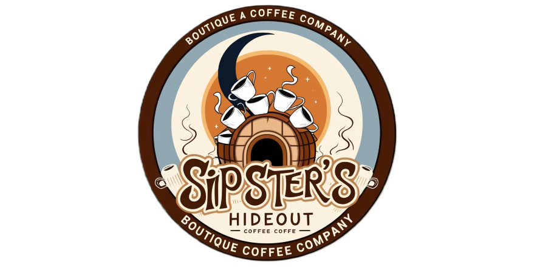

# Sipster's Hideout Customers & Sales Analysis

## Project Overview


This project involves the analysis of sales, revenue and customer data for a made-up coffee shop named **Sipsters's Hideout**. The primary objective is to derive actionable insights from the available data to help the coffee shop improve its sales, marketing strategies, and customer satisfaction. By analyzing trends, patterns, and anomalies in the data, I aimed to provide recommendations to enhance business performance and growth.  

## Table of content
- 📖 [Project Overview](#project-overview)
- 🎯 [Goals of Analysis](#goals-of-analysis)
- ⚠️ [Disclaimer](#disclaimer)
- ⚙️ [Data Source](#data-source)
- 🧹 [Data Cleaning And Preparation](#data-cleaning-and-preparation)
   - 🧍 [Customers Sheet](#customers-sheet)
   - 📦 [Products Sheet](#products-sheet)
   - 🛒 [Orders Sheet](#orders-sheet)
- 📈 [Analysis](#analysis)
   - 👥 [Customers](#customers)
   - 📦 [Products](#products)
   - 📜 [Orders History](#orders-history)
- 💡 [Recommendations](#recommendations)
- 🙏 [Acknowledgement](#acknowledgement)
- 🌐 [Used Sources](#used-sources)

## Goals of Analysis
The goals of this analysis are to address the specific requirements outlined by the stakeholder:

1. **Customer Insights:**
    - **Demographic Breakdown**  
    Analyze customer demographics, including age, gender, and location, to better understand the customer base.
   - **Purchase Behaviors**  
   Examine purchase behaviors such as frequency of purchases, types of coffee preferred, and average spending per visit to identify patterns and preferences.

2. **Product Performance**
   - **Sales Volume by Coffee Type**  
   Identify the sales volume for each type of coffee to determine which products are most popular.
   - **Revenue Contribution**  
   Evaluate the revenue contribution of each type of coffee to understand their impact on overall sales.
   - **Seasonal Trends:**  
   Analyze seasonal trends in coffee sales to identify peak periods and adjust inventory and marketing strategies accordingly.

3. **Order History Analysis**
   - **Peak Order Times and Days**  
   Identify the times and days with the highest order volumes to optimize staffing and operations.
   - **Common Order Combinations**  
   Discover common combinations of items ordered together to create targeted promotions and upselling strategies.
   - **Customer Retention Rates**  
   Assess customer retention rates based on order history to identify factors that contribute to customer loyalty and repeat business.

To get stakeholder requirements for my project I used [ChatGPT](https://chatgpt.com/) to behave as stakeholder for my project.

## Disclaimer
⚠️ Beacuse I'm using **Windows 10** machine with region set to **Slovakia** my formulas require `;` instead of `,`. ⚠️  
⚠️ Logo of Sipster's Hideout was generated with power of [Leonardo AI](https://leonardo.ai/). As of the publication date of this analysis (July 18th, 2024), no company exists with this name.⚠️  
⚠️ To get stakeholder requirements for my project I used [ChatGPT](https://chatgpt.com/) to behave as stakeholder for my project. ⚠️

## Data Source
For this analysis I used dataset of [coffee sales](https://github.com/mochen862/excel-project-coffee-sales/blob/main/coffeeOrdersData.xlsx) from GitHub of **Mo Chen** (CC0: Public Domain, dataset made available through [Mo Chen](https://github.com/mochen862)).
This dataset is in the form of an Excel spreadsheet with 3 sheets:
### orders
- **1 000** coffee orders
- years **2019-2022**
- **5** columns
- some **multi-item** orders

| **Column #**   | **Column Name**       | **Description**          |
|----------------|-----------------------|--------------------------|
| **0**          | Order ID              | ID of the order          |
| **1**          | Order Date            | date of the order        |
| **2**          | Customer ID           | customer ID              |
| **3**          | Product               | type of coffee           |
| **4**          | Quantity              | number of packages       |

### products
- **48** products
- **7** columns
- **3** types of **roast** and **bean**
- package sizes **0.2, 0.5, 1** and **2.5** kg
- **3** roast types: **Light, Medium, Dark**
- **4** bean types: **Arabica, Liberica, Excelsa, Robusta**

| **Column #**   | **Column Name**       | **Description**          |
|----------------|-----------------------|--------------------------|
| **0**          | Product ID            | product ID               |
| **1**          | Coffee Type           | type of coffee bean      |
| **2**          | Roast Type            | type of roast            |
| **3**          | Size                  | size of package          |
| **4**          | Unit Price            | unit price in $          |
| **5**          | Price per 100g        | price in $ for 0.1 kg    |
| **6**          | Profit                | profit in $              |

### customers
- **1 000** customers
- **9** columns
-  **3** countries: **USA, United Kingdom (UK), Ireland**
- **Phone Number** and **Email** columns have some **missing** values

| **Column #**   | **Column Name**       | **Description**                          |
|----------------|-----------------------|------------------------------------------|
| **0**          | Customer ID           | customer ID                              |
| **1**          | Customer Name         | full name                                |
| **2**          | Email                 | email                                    |
| **3**          | Phone Number          | phone numebr                             |
| **4**          | Address Line 1        | full address                             |
| **5**          | City                  | city or town                             |
| **6**          | Country               | country                                  |
| **7**          | Post Code             | post code                                |
| **8**          | Loyalty Card          | **yes** if holder otherwise **no**       |

This dataset also had in `orders` sheet some empty columns, which I removed right away to have clean sheet with only necessary columns.

## Data Cleaning And Preparation
### Customers Sheet
Firstly I needed to prepare sheets to desired form. I started with adding **Name** and **Surename** columns into `customers` sheet. This was done because I like names being available if I need to search for specific names or families.  I addded values to the Name column using: 
```excel
=TEXTBEFORE(B2; " ")
```
This formula takes cell B2 as an argument, searches for the first  **space**, and returns everything before that space. For the Surname column, I used the function:
```excel
=TEXTAFTER(B2; " ")
``` 
This works similarly to `TEXTBEFORE()` but returns everything after the first space. 

I also renamed and rearranegd columns to make it more readable. Here are the changes:
- **Customer Name** -> **Full Name**
- **Address Line** -> **Address**
- moved Name and Surename columns **after** Full Name column

The **Email** and **Phone Number** columns had some empty records because some customers hadn't provided this data. I decided to assign these empty cells the value `not provided` instead of leaving them null. I created two new columns by applying this logic. For **Email**, I used this formula: 
```excel
=IF(E2 <> 0; E2; "not provided")
``` 
and for **Phone Number** this formula: 
```excel
=IF(F2 <> 0; F2; "not provided")
``` 
Both of these formulas return the cell value if it's not empty; otherwise, they return `not provided`. Then I copied the values only from these newly created columns into the original columns and removed the unused ones. I used the `IF()` function because it was the best fit for filling empty cells with meaningful data.

After these changes sheet looked like this:


### Products Sheet
The products sheet needed some adjustments as well. I wanted to see the full name of the coffee bean and the full name of the coffee roast instead of abbreviations. Also, Arabica, Excelsa, etc., are bean types, **not** coffee types, so I changed the naming of this column.  
For this purpose I created a sheet `coffee names & roast types` in which I created tables for bean and roast type mapping.


I used the `VLOOKUP()` function to populate the products sheet with the desired full names. For mapping the bean type, I used this formula:
```excel
=VLOOKUP(B2;'coffee names & roast types'!$A$2:$B$5;2;)
``` 
and for roast type this formula: 
```excel
=VLOOKUP(C2;'coffee names & roast types'!$E$2:$F$4;2;)
```
Both `VLOOKUP()` functions are mapping cell value B2 or C2 in `products` sheet with corresponding value in sheet `coffee names & roast types` and returning **exact match** in second column from range A2:B5 in `coffee names & roast types` sheet.

At the end, I copied only the values from the newly created columns, pasted them into the old columns, and removed the unused columns.

After all the changes sheet looked like this:


### Orders Sheet
A lot of a things needed to be done in this sheet. I started with creating following new columns:

#### Customer Name
For populating the Customer Name column, I used this function:
```excel
=VLOOKUP(C2;customers!$A$2:$B$1001;2;)
```
This formula is mapping cell C2 to coresponding value in sheets `customers` range A2:B1001 and returns value from second row of range.

#### Address
To have the full address in one column, I used this formula:
```excel
=CONCATENATE(VLOOKUP(C2;customers!$A$2:$H$1001;7;);", ";VLOOKUP(C2;customers!$A$2:$H$1001;8;))
```

This formula concatenates the address and city from the customers sheet, separating them with a comma and a space.

#### Country
For the Country column, I used the newly introduced (supported in Office 365, Excel 2021 and Excel for web) function not supported at older Office versions:

```excel
=XLOOKUP(C2;customers!$A$2:$A$1001;customers!$I$2:$I$1001;;0;)
```

This formula is mapping cell C2 to coresponding value in sheets `customers` range I2:I1001 and returns value from this row.
#### Email
The Email column was populated with this function:
```excel
=VLOOKUP(C2;customers!$A$1:$E$1001;5;)
```

This formula is mapping cell C2 to coresponding value in sheets `customers` range A2:E1001 and returns value from fifth row.

#### Bean Type, Roast Type, Size and Unit Price**
These columns were populated using the following formula:
```excel
=INDEX(products!$A$1:$G$49;MATCH(orders!$D2;products!$A$1:$A$49;0);MATCH(orders!J$1;products!$A$1:$G$1;0))
```

This formula retrieves a value from a table based on a row and column match. The `MATCH()` functions determine the row and column numbers where the specified values are found, and the `INDEX()` function then uses these row and column numbers to return the value at the intersection within the specified range.

#### Sale
First this column I applied very simple formula:
```excel
=E2*M2
```

This formula multiplies quantity and unit price.

#### Loyalty Card
This column was populated with this formula:
```excel
=XLOOKUP(C2;customers!$A$2:$A$1001;customers!$K$2:$K$1001;;0)
```

This formula is mapping cell C2 to coresponding value in sheets `customers` range K2:K1001 and returns value from this row.

#### Weight
I populated this colum via this formula:
```excel
=E2*L2
```

This formula multiplies quantity and unit price.

#### Product Revenue
The last column, was populated with data based on this formula: 
```excel
=E2*VLOOKUP(D2;products!$A$2:$G$49;7;)
```

This formula multiplies value of cell E2 with mapped cell D2 to coresponding value in sheets `products` range A2:G49 and returns value from seventh row.

After all these steps sheet looked like this:


As last step of cleaning I checked for duplictae records in dataset. Thankfully no duplictae values were found.

## Analysis

### Customers
In this section I'll cover customers analysis of Sipster's Hideout customers.  
 
#### Distribution
Distribution of customers among different countries:
- **USA**: 78%
- **Ireland**: 15%
- **UK**: 7%

{width = 50%}

#### Email and Phone
The majority of customers have provided the company with their email or phone numbers. Among all customers:
- **80%** have provided their email addresses.
- **87%** have provided their phone numbers.

#### Loyalty Card
The company has a loyalty program that is not reaching its full potential. Only **51%** of all customers are loyalty card holders. Every single country has fewer customers **without** a loyalty card, with the exception of **Ireland**, where more customers have a loyalty card.

{width = 50%}

#### Averages
Customers are spending on average **$47.16** and are buying a coffee with average weight of **3.79 kg**. Average profit from orders is **$4.72**. Here's how average spending, profit and weight varies across countries:

|                 | **USA**| **Ireland**  | **UK** |
|-----------------|--------|--------------|--------|
| **Avg. spend**  | $95.8  | $91.11       | $81.12 |
| **Avg. weight** | 7.7 kg | 7.41 kg      | 6.3 kg |
| **Avg. profit** | $9.58  | $9.13        | $8.26  |

#### Bean Type
Everybody has different taste, and this applies here as well. Some prefer Arabica, while others favor Excelsa. When it comes to the prefered bean type among customers, there is no clear winner. Arabica is preferred by **26%** of customers, just **1%** less than Excelsa and Liberica, and **2%** less than Robusta.

{width = 50%}

That's overall customer preference but, what about preference in each country. Here things become more interesting. Let's look at the numbers:

|               | **USA**| **Ireland**  | **UK** |
|---------------|--------|--------------|--------|
| **Arabica**   | **28%**| **27%**      | 10%    |
| **Excelsa**   | 25%    | 23%          | **31%**|
| **Liberica**  | 24%    | 25%          | 29%    |
| **Robusta**   | 23%    | 25%          | 30%    |

#### Roast Type
Preferences for roast type are also diverse. Some customers prefer lightly roasted coffee, while others like it as dark as possible. The distribution of roast type preferences is almost evenly divided into thirds. More people prefer Medium roast (34%), while Light and Dark are preferred by 33% each.

{width = 50%}

However, this data does not represent the preferences in each country accurately. Here are the actual preferences by country:

|           | **USA**| **Ireland**  | **UK** |
|-----------|--------|--------------|--------|
| **Light** | 33%    | 31%          | 31%    |
| **Medium**| **35%**| 26%          | **38%**|
| **Dark**  | 32%    | **43%**      | 26%    |

**Insights:**
- missing data on customer age, gender, and bean/roast preference
- USA customers are missing state info
- majority of customers from **USA**
- high percentage of customers have provided email and phone numbers
- low number of loyalty card holders
- even bean preference, except for the UK, which prefers Excelsa (31%)
- prefered roast is Medium, except in Ireland, which prefers Dark (43%)
- not enough orders to analyze frequency or patterns in customers order tendencies

### Products
For every business, sales and revenue are crucial. How are each of the bean and roast types performing in these metrics?
In terms of sales, the bestseller is Excelsa (27%), and the worst-selling is Robusta (20%). The best-selling roast type is Light (39%), and the worst-selling is Dark (29%). Looking at these numbers, bean types are more evenly distributed in terms of sales than roast types.  

{width = 50%}
{width = 50%}

We know how much sales each bean and roast type generates, but what about the revenue? Among bean types, the most revenue is generated by Liberica (35%) and the least by Robusta (12%). The roast that generates the most revenue is Light (38%), and the one that generates the least is Dark (30%). Looking at the numbers, it's clear that even though sales by bean type are almost evenly distributed, the revenue is not.  

{width = 50%}
{width = 50%}

**Insights:**
- best selling bean type is Excelsa (27%)
- best selling roast type is Light (39%)
- bean type generating the most revenue is Liberica (35%)
- roast type generating the most revenue is Light (38%)
- bigger gaps among bean type revenue than sales distribution

### Orders History
Due to data limitations for the year 2022 (only the first eight months are available), the analysis is divided into two parts: 2019-2021 and 2022. This approach prevents the incomplete 2022 data from skewing sales and revenue patterns. 

#### 2019-2021

Sales:
- **Best Sales Months**: February, October
- **Worst Sales Months**: January, August
- **Best Sales Day**: Friday
- **Worst Sales Day**: Tuesday
- **Best Sales Quarter**: Q4
- **Worst Sales Quarter**: Q3

Revenue:
- **Best Revenue Months**: February, April, October
- **Worst Revenue Months**: January, May, August
- **Best Revenue Day**: Sunday
- **Worst Revenue Day**: Tuesday
- **Best Revenue Quarter**: Q4
- **Worst Revenue Quarter**: Q3

Orders:
- **Most Orders Month**: October
- **Most Orders Day**: Friday
- **Least Orders Month**: August
- **Least Orders Day**: Monday

#### 2022

Sales:
- **Best Sales Months**: March, January
- **Worst Sales Months**: August, February
- **Best Sales Day**: Sunday
- **Worst Sales Day**: Saturday
- **Best Sales Quarter**: Q1
- **Worst Sales Quarter**: Q3

Revenue:
- **Best Revenue Months**: January, March
- **Worst Revenue Months**: August, February
- **Best Revenue Day**: Sunday
- **Worst Revenue Day**: Saturday
- **Best Revenue Quarter**: Q1
- **Worst Revenue Quarter**: Q3

Orders:
- **Most Orders Month**: March
- **Most Orders Day**: Friday
- **Least Orders Month**: August
- **Least Orders Day**: Saturday

**Insights:**
- the data includes only the first eight months of 2022.
- there is insufficient data on multi-item orders (only 32 in the dataset) to determine patterns in common combinations sold together.
- the data spans only three years and lacks sufficient information about customer orders to provide insights on customer retention rates.
- best months for sales in 2019-2021 were February and October, while in 2022, they were March and January.
- worst sales months in 2019-2021 were January and August, and in 2022, they were August and February
- best revenue months in 2019-2021 were February, April, and October, while in 2022, they were January and March
- worst revenue months in 2019-2021 were January, May, and August, and in 2022, they were August and February
- most orders in 2019-2021 occurred in October and on Fridays and in 2022, the most orders were in March and also on Fridays 
-  least orders in 2019-2021 were in August and on Mondays and in 2022, the least orders were in August and on Saturdays
- best quarter for sales and revenue in 2019-2021 was Q4 and in 2022, the best quarter was Q1
- worst quarter for sales and revenue in 2019-2021 was Q3 and in 2022, the worst quarter was Q3

## Recommendations

Based on the insights gathered from the customers, sales and revenue analysis, here are some recommendations for Sipster's Hideout:

1. **Inventory Management**:
   - Increase coffee stock levels for months with high demand such as February, June, and October to ensure availability and meet customer demand.

2. **Targeted Marketing Campaigns**:
   - Develop promotional deals specifically targeted at customers in the UK and Ireland. For example, consider offering promotions on Dark roast coffee specifically for the Irish market to capitalize on their preference or give $6 off from first purchase in these contries.

3. **Customer Data Collection**:
   - Collect demographic data including age, gender, and preferences beyond traditional binary options to better understand customer profiles and tailor marketing strategies accordingly.

4. **Personalized Customer Preferences**:
   - Implement a customer profile system to track favorite coffee types and roast preferences. This data can be used to customize promotional actions and offerings tailored to specific regional tastes.

5. **Loyalty Program Promotion**:
   - Promote the benefits of the loyalty card program more effectively. Consider implementing a referral program where existing members receive a $10 discount on orders over $50 for each new member they refer.

6. **Seasonal Promotions**:
   - Boost sales during slower summer months, especially in August, by introducing summer-themed deals or special offers to attract more customers during traditionally quieter periods.

7. **Market Research in EU Countries**:
   - Conduct surveys in EU countries to understand reasons behind lower purchase rates compared to US customers. Investigate factors such as shipping costs, import fees, and customer satisfaction to address potential barriers.

8. **Sample Sets with Orders**:
   - Enhance customer experience by offering a complimentary sample set with every order over $50. This allows customers to explore different coffee types without committing to larger purchases upfront.

9. **Bulk Purchase Incentives**:
   - Educate customers about the cost savings of purchasing larger packages, emphasizing that bigger packages are cheaper per 100g. This strategy not only benefits customers but also increases profitability for the company.

10. **Understanding May Sales in the UK**:
    - Investigate reasons why customers in the UK do not purchase during May. Conduct targeted marketing research or customer surveys to uncover potential barriers and develop strategies to boost sales during this period.
11. **Try Out New Roast Type**
      - Since we sell Light, Medium, Dark roast it would be worth a try to sell Medium-Dark roast for six months and than evaluate if this dicision helps with sales.

These recommendations aim to capitalize on identified opportunities, address challenges, and enhance overall business performance for Sipster's Hideout. Implementing these strategies can potentially improve customer satisfaction, increase sales, and strengthen market presence in targeted regions.

## Acknowledgement
Special thanks to **Mo Chen** for his dataset and lot of valuable lessosns that I learned from him over the last two years.  
And of course thank you for investing your time in exploring this analysis with me. I hope you found this analysis and the insights as captivating as I did and that this project ignites your curiosity to delve deeper into this dataset or one of your choosing.

## Used Sources
https://chatgpt.com/  
https://github.com/mochen862/excel-project-coffee-sales/blob/main/coffeeOrdersData.xlsx  
https://leonardo.ai/  
